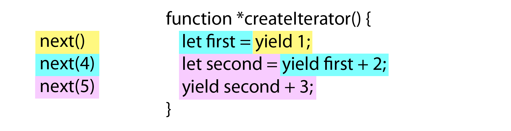
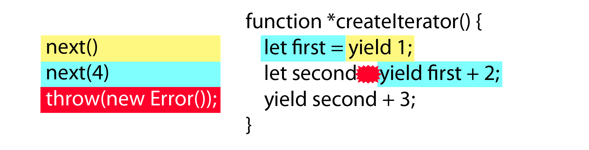

<div dir="rtl">

# איטרטורים וגנרטורים

שפות תכנות רבות עברו מאיטרציה על נתונים באמצעות לולאות

שדורשות אתחול משתנים על מנת לעקוב אחר מיקום הפריטים באוסף, לשימוש באוביקטים מסוג איטרטור שמתוכנתים להחזיר את הפריט הבא ברשימה. איטרטורים מקלים על עבודה עם אוספים של מידע, ואקמהסקריפט 6
מוסיפה איטרטורים לג׳אווהסקריפט. בשילוב עם מתודות חדשות עבור מערך ואוספים מסוגים חדשים
(כמו סט ומפה),
איטרטורים חיוניים לעיבוד נתונים יעיל ומוצאים אותם בחלקים רבים של השפה. ראו לדוגמה את לולאת
`for-of`
שעובדת עם איטרטורים,
את אופרטור הפיזור
(`...`)
שמשתמש באיטרטורים,
ואיטרטורים גם מקלים על תכנות אסינכרוני.

הפרק הזה מרחיב על השימושים הרבים של איטרטורים, אך קודם, חשוב להבין את הסיבה מדוע הוסיפו איטרטורים לג׳אווהסקריפט.

## בעיית הלולאה

אם אי פעם כתבתם קוד בג׳אווהסקריפט, קרוב לוודאי שכתבתם קוד דומה לדוגמה הבאה:

<div dir="ltr">

```js
var colors = ["red", "green", "blue"];

for (var i = 0, len = colors.length; i < len; i++) {
    console.log(colors[i]);
}
```

</div>

לולאת 
`for`
הסטנדרטית עוקבת אחר האינדקס במערך
`colors`
באמצעות המשתנה
`i`.
ערכו של 
`i`
גדל כל פעם שהלולאה רצה כל עוד אינו גדול יותר מאורך המערך
(
    שנשמר במשתנה
    `len`
).

למרות שמדובר בלולאה פשוטה, לולאות גדלות במורכבותן כאשר משתמשים בלולאות פנימיות ונוצר צורך לעקוב אחר מספר משתנים. מורכבות גדולה יותר יכולה להוביל לשגיאות, והטבע השבלוני של לולאת
`for`
נוטה לייצר שגיאות נוספות כאשר קוד דומה נכתב במספר מקומות. איטרטורים נועדו לפתור בעיה זו.

## מהם איטרטורים?

איטרטורים הם אוביקטים אשר מממשים ממשק ספציפי שתוכנן עבור איטרציה. כל איטרטור מממש מתודת
<span dir="ltr">`next()`</span>
שמחזירה תוצאה שגם היא אוביקט.
לאוביקט התוצאה יש שתי תכונות:
`value`,
שמייצגת את הערך הבא, ותכונת
`done`, 
בעלת ערך בוליאני שערכו
`true`
כאשר אין עוד ערכים להחזיר. האיטרטור שומר על מצביע פנימי למקום בתוך אוסף הערכים ובכל קריאה למתודה
<span dir="ltr">`next()`</span>
יחזיר את הערך הבא.

אם קוראים למתודה
<span dir="ltr">`next()`</span>
לאחר שהערך האחרון כבר הוחזר, המתודה מחזירה תוצאה עם התכונה
`done`
בעלת ערך
`true`
והתכונה
`value`
מכילה את 
*ערך החזרה*
(*return value*)
.עבור האיטרטור
ערך החזרה אינו חלק מאוסף הנתונים, אלא יותר מעין חתיכה אחרונה של מידע קשור, או שיקבל את הערך 
`undefined`
כערך דיפולטיבי.
ערך החזרה של איטרטור דומה לערך החזרה של פונקציה בכך שהוא מהווה דרך להעביר מידע למי שקרא לאיטרטור.

בהתחשב באמור לעיל, יצירת איטרטור באקמהסקריפט 5 היא עניין פשוט:

<div dir="ltr">

```js
function createIterator(items) {

    var i = 0;

    return {
        next: function() {

            var done = (i >= items.length);
            var value = !done ? items[i++] : undefined;

            return {
                done: done,
                value: value
            };

        }
    };
}

var iterator = createIterator([1, 2, 3]);

console.log(iterator.next());           // "{ value: 1, done: false }"
console.log(iterator.next());           // "{ value: 2, done: false }"
console.log(iterator.next());           // "{ value: 3, done: false }"
console.log(iterator.next());           // "{ value: undefined, done: true }"

// for all further calls
console.log(iterator.next());           // "{ value: undefined, done: true }"
```
</div>

הפונקציה
<span dir="ltr">`createIterator()`</span>
מחזירה אוביקט עם מתודת
<span dir="ltr">`next()`</span>
כל פעם שהמתודה נקראת היא מחזירה את הערך הבא במערך
`items`
בתור ערך התכונה
`value`. 
כאשר
`i`
שווה ל-3,
`done`
מקבל את הערך
`true`
וערכו של 
`value`
משתנה לערך
`undefined`.
התוצאות הללו מקיימות את התנאי עבור איטרטורים באקמהסקריפט 6, לגבי הקריאה למתודה 
<span dir="ltr">`next()`</span>
על איטרטור לאחר שהערך האחרון באוסף הוחזר.

כפי שהדוגמה הקודמת ממחישה, כתיבת איטרטורים שמתנהגים בהתאם לכללים שהוגדרו באקמהסקריפט 6
יכולה להיות עניין מורכב.

למזלנו, אקמהסקריפט 6 מספקת לנו גנרטורים, שהופכים יצירת איטרטורים לעניין פשוט.

## מהם גנרטורים?

*גנרטור*
(*generator*) 
הוא פונקציה שמחזירה איטרטור. פונקציות מסוג גנרטור מסומנות בכוכב
(`*`)
לאחר המילה השמורה
`function`
ומשתמשות במילה השמורה
`yield`.
זה לא חשוב אם הכוכב מופיע מיד לאחר המילה
`function`
או אם יש רווח ביניהם, כפי שרואים בדוגמה הבאה:


<div dir="ltr">

```js
// גנרטור
function *createIterator() {
    yield 1;
    yield 2;
    yield 3;
}

// קוראים לגנרטור כמו פונקציה רגילה אבל מוחזר איטרטור
let iterator = createIterator();

console.log(iterator.next().value);     // 1
console.log(iterator.next().value);     // 2
console.log(iterator.next().value);     // 3
```
</div>

הסימון 
`*`
לפני
<span dir="ltr">`createIterator()`</span>
הופך את הפונקציה לגנרטור. המילה השמורה
`yield`
שגם היא תוספת חדשה לאקמהסקריפט 6, מייצגת ערכים שהאיטרטור יחזיר בעת הקריאה למתודה
<span dir="ltr">`next()`</span>,
לפי הסדר בו יש להחזיר אותם. לאיטרטור שנוצר בדוגמה זו יש שלושה ערכים שונים להחזיר בעת קריאה למתודה
<span dir="ltr">`next()`</span>:
תחילה
`1`,
ואז
`2`,
ולבסוף
`3`.
קוראים לגנרטור בדיוק כמו כל פונקציה אחרת, כפי שראינו כאשר נוצר המשתנה
`iterator`.

אחד ההיבטים המעניינים ביותר של גנרטורים הוא שהם משהים את הרצת הקוד לאחר כל פקודת
`yield`.
למשל, לאחר שהפקודה
`yield 1`
רצה, הפונקציה לא תמשיך לרוץ עד אשר המתודה 
<span dir="ltr">`next()`</span>
של האיטרטור תיקרא שוב.
בנקודה זו הפקודה
`yield 2`
תרוץ. יכולת זו להשהות את הרצת הקוד באמצע הפונקציה בעלת פוטנציאל גדול ומובילה למספר שימושים מעניינים לגנרטורים
(
    נדון בהם בסעיף
    ״יכולות איטרטור מתקדמות״
).

המילה השמורה
`yield` 
יכולה לשמש עבור כל ערך או ביטוי
(expression),
ולכן ניתן לכתוב גנרטורים שמוסיפים פריטים לאיטרטורים מבלי לציין את הפריטים אחד אחר השני. להלן דוגמה בה ניתן להשתמש ב
`yield` 
בתוך לולאת
`for`:


<div dir="ltr">

```js
function *createIterator(items) {
    for (let i = 0; i < items.length; i++) {
        yield items[i];
    }
}

let iterator = createIterator([1, 2, 3]);

console.log(iterator.next());           // "{ value: 1, done: false }"
console.log(iterator.next());           // "{ value: 2, done: false }"
console.log(iterator.next());           // "{ value: 3, done: false }"
console.log(iterator.next());           // "{ value: undefined, done: true }"

// עבור כל קריאה נוספת
console.log(iterator.next());           // "{ value: undefined, done: true }"
```
</div>

הדוגמה לעיל מעבירה מערך בשם
`items`
לגנרטור
<span dir="ltr">`createIterator()`</span>.
בתוך הפונקציה לולאת 
`for`
מעבירה פריטים מהמערך לאיטרטור ככל שהלולאה מתקדמת. כל פעם שהלולאה מגיעה לפקודת
`yield`
הלולאה נעצרת, וכל פעם שהמשתנה
`iterator`
קורא למתודה
<span dir="ltr">`next()`</span>.
הלולאה ממשיכה לפקודת 
`yield`
הבאה.

גנרטורים הם תוספת חשובה באקמהסקריפט 6, ומכיוון והם פונקציות לכל דבר, הם יכולים לעבוד באותם מקומות. יתר הפרק מתמקד בדרכים שימושיות אחרות לכתוב גנרטורים.


W> המילה השמורה
W> `yield`
W> יכולה לעבוד רק בתוך גנרטורים. שימוש ב
W> `yield`
W> בכל מקום אחר נחשב לשגיאה תחבירית, וזה תקף גם עבור פונקציות 
W> שמוגדרות בתוך גנרטור, כמו למשל:
W> 
W> <div dir="ltr">
W>
W> ```js
W> function *createIterator(items) {
W>
W>     items.forEach(function(item) {
W>
W>         // syntax error
W>         yield item + 1;
W>     });
W> }
W> ```
W> למרות שפקודת
W> `yield`
W> נמצאת בתוך גנרטור נזרקת שגיאת תחסיר מכיוון שפקודת 
W> `yield`
W> אינה יכולה לחצות גבולות פונקציה. מבחינה זו
W> `yield`
W> דומה לפקודת
W> `return`,
W> בכך שפונקציה פנימית אינה יכולה להחזיר ערך עבור הפונקציה 
W> החיצונית.

</div>

###  גנרטורים כביטוי קוד

ניתן ליצור גנרטור כביטוי רק על ידי כתיבת כוכב
(`*`)
בין המילה 
`function`
לבין הסוגריים הפותחים. לדוגמה:

<div dir="ltr">

```js
let createIterator = function *(items) {
    for (let i = 0; i < items.length; i++) {
        yield items[i];
    }
};

let iterator = createIterator([1, 2, 3]);

console.log(iterator.next());           // "{ value: 1, done: false }"
console.log(iterator.next());           // "{ value: 2, done: false }"
console.log(iterator.next());           // "{ value: 3, done: false }"
console.log(iterator.next());           // "{ value: undefined, done: true }"

// for all further calls
console.log(iterator.next());           // "{ value: undefined, done: true }"
```

</div>
 
בדוגמה לעיל, הפונקציה
<span dir="ltr">`createIterator()`</span>.
נחשבת לביטוי פונקציה 
(generator function expression)
ולא הגדרת פונקציה
(function declaration).
הכוכב מופיע בין המילה השמורה
`function`
לבין הסוגר הפותח מכיוון שביטוי הפונקציה הוא אנונימי. מלבד הבדל זה הדוגמה זהה לגרסה הקודמת של הפונקציה
<span dir="ltr">`createIterator()`</span>
שגם היא השתמשה בלולאת 
`for`.

I> לא ניתן ליצור פונקציה חץ שהיא גם גנרטור

### מתודות מסוג גנרטור

מכיוון שגנרטורים הם פונקציות, אפשר להוסיף אותם לאוביקטים. לדוגמה, אפשר ליצור גנרטור באוביקט ליטראל באקמהסקריפט 5 באמצעות ביטוי פונקציה
(function expression):

<div dir="ltr">

```js
var o = {

    createIterator: function *(items) {
        for (let i = 0; i < items.length; i++) {
            yield items[i];
        }
    }
};

let iterator = o.createIterator([1, 2, 3]);
```

</div>

אפשר להשתמש בתחביר המקוצר למתודה של אקמהסקריפט 6 באמצעות הוספת כוכב
(`*`)
לפני שם המתודה:

<div dir="ltr">

```js
var o = {

    *createIterator(items) {
        for (let i = 0; i < items.length; i++) {
            yield items[i];
        }
    }
};

let iterator = o.createIterator([1, 2, 3]);
```

</div>

הדוגמאות הנ״ל מתנהגות כמו הדוגמה בסעיף ״גנרטורים כביטוי קוד״. רק התחביר שונה. בגרסה המקוצרה, מפני שהמתודה
<span dir="ltr">`createIterator()`</span>
מוגדרת ללא המילה השמורה
`function`, 
הכוכב מופיע מיד לפני שם המתודה, למרות שניתן לשים רווחים בין הכוכב לבין שם המתודה.

## איטרבילים ו for-of

אוביקט בעל קשר הדוק לאיטרטור הוא אוביקט
*איטרבילי*
(*iterable*), 
אוביקט עם התכונה
`Symbol.iterator`.
הסימבול המובנה
`Symbol.iterator`
מפנה לפונקציה שמחזירה איטרטור עבור אוביקט נתון. כל האוביקטים שנחשבים לאוסף
(מערך, סט ומפה)
ומחרוזות הם איטרבילים באקמהסקריפט 6 ולכן מוגדר עבורם איטרטור מובנה. אוביקטים איטרבילים משמשים בתוספת החדשה של אקמהסקריפט:
לולאת
`for-of`.

I> כל האיטרטורים שנוצרים על ידי גנרטור הם איטרביליים, מפני שגנרטורים מגדירים את התכונה
`Symbol.iterator`
כברירת מחדל.

בתחילת הפרק, הוזכרה הבעיה של מעקב אחר אינדקס בתוך לולאת
`for`
איטרטורים הם הצעד הראשון לפתרון הבעיה. לולאת 
`for-of`
היא הצעד הבא: היא מייתרת את הצורך לעקוב אחר אינדקס בתוך אוסף, וכך מתאפשר לנו להתמקד רק בעבודה עם תוכן האוסף.

לולאת 
`for-of`
קוראת למתודה
<span dir="ltr">`next()`</span>
של איטרטור בכל איטרציה של הלולאה ושומרת את 
`value`
שמגיע מאוביקט התוצאה בתוך משתנה. הלולאה ממשיכה לעשות זאת עד אשר אוביקט התוצאה מחזיר את הערך
`true`
עבור התכונה
`done`.
לדוגמה:

<div dir="ltr">

```js
let values = [1, 2, 3];

for (let num of values) {
    console.log(num);
}
```

</div>

הקוד בדוגמה מייצר את הפלט הבא:

```
1
2
3
```

לולאת
`for-of`
תחילה קוראת למתודה 
`Symbol.iterator`
על המערך
`values`
כדי להשיג איטרטור
(
    הקריאה ל-
    `Symbol.iterator`
    מתרחשת מאחורי הקלעים על ידי מנוע הריצה עצמו
).
לאחר מכן קוראים ל-
<span dir="ltr">`iterator.next()`</span>
והתכונה
`value`
של אוביקט התוצאה מועברת לתוך המשתנה
`num`.
המשתנה 
`num`
מקבל תחילה את הערך 1,
לאחר מכן את הערך 2
ולבסוף את הערך 3. 
הלולאה מפסיקה לרוץ
כאשר התכונה 
`done`
על אוביקט התוצאה מקבלת את הערך
`true`,
ולכן
`num`
לא יקבל את הערך
`undefined`.

אם נרצה רק לעבור על פריטים בתוך מערך או אוסף, אז מומלץ להשתמש בלולאת
`for-of`
במקום לולאת 
`for`
לולאת 
`for-of`
פחות נוטה לבעיות מפני שיש פחות ערכים לבדוק. עדיף לשמור את לולאת
`for`
עבור מצבים יותר מורכבים.

W> לולאת 
`for-of`
תזרוק שגיאה כאשר היא מופעלת על אוביקט שאינו איטרבילי
`null`,
או 
`undefined`.

### גישה לאיטרטור הדיפולטיבי

ניתן להשתמש ב
`Symbol.iterator`
כדי לגשת לאיטרטור הדיפולטיבי של אוביקט, כמו בדוגמה הבאה:

<div dir="ltr">

```js
let values = [1, 2, 3];
let iterator = values[Symbol.iterator]();

console.log(iterator.next());           // "{ value: 1, done: false }"
console.log(iterator.next());           // "{ value: 2, done: false }"
console.log(iterator.next());           // "{ value: 3, done: false }"
console.log(iterator.next());           // "{ value: undefined, done: true }"
```

</div>

הקוד בדוגמה משיג את האיטרטור הדיפולטיבי עבור
`values`
ומשתמש בו כדי לעבור על הפריטים במערך. זהו אותו תהליך שמתרחש מאחורי הקלעים בעת שימוש בלולאת
`for-of`.

מכיוון ש 
`Symbol.iterator`
מגדיר את האיטרטור הדיפולטיבי בעבור אוביקט, ניתן להשתמש כדי לדעת האם אוביקט הוא איטרבילי כמו בדוגמה הבאה:

<div dir="ltr">

```js
function isIterable(object) {
    return typeof object[Symbol.iterator] === "function";
}

console.log(isIterable([1, 2, 3]));     // true
console.log(isIterable("Hello"));       // true
console.log(isIterable(new Map()));     // true
console.log(isIterable(new Set()));     // true
console.log(isIterable(new WeakMap())); // false
console.log(isIterable(new WeakSet())); // false
```

</div>

הפונקציה
<span dir="ltr">`isIterable()`</span>
בודקת האם קיים איטרטור דיפולטיבי על האוביקט והאם מדובר בפונקציה.
לולאת 
`for-of`
מבצעת פעולה דומה לפני ריצה.

עד עתה, הדוגמאות בחלק זה הציגו דרכים להשתמש ב 
`Symbol.iterator`
יחד עם אוביקטים איטרבילים מובנים, אך ניתן להשתמש ב 
`Symbol.iterator`
כדי ליצור אוביקטים איטרבילים משלכם.

### יצירת אוביקטים איטרבילים

אוביקטים חדשים שנוצרים על ידי מפתחים אינם איטרבילים כברירת מחדל, אך ניתן להפוך אותם לכאלה באמצעות הגדרת התכונה 
`Symbol.iterator`
שמצביעה על גנרטור. לדוגמה:

<div dir="ltr">

```js
let collection = {
    items: [],
    *[Symbol.iterator]() {
        for (let item of this.items) {
            yield item;
        }
    }

};

collection.items.push(1);
collection.items.push(2);
collection.items.push(3);

for (let x of collection) {
    console.log(x);
}
```

</div>

הקוד מייצר את הפלט הבא:

```
1
2
3
```

ראשית, הקוד בדוגמה מגדיר איטרטור דיפולטיבי עבור אוביקט בשם
`collection`.
האיטרטור הדיפולטיבי נוצר על ידי המתודה
`Symbol.iterator`
שהיא גנרטור
(שימו לב שהכוכב עדיין בא לפני שם הפונקציה).
הגנרטור משתמש בלולאת 
`for-of`
כדי לעבור על הערכים בתוך
`this.items`
ומשתמש ב 
`yield`
כדי להחזיר כל אחד מהם. במקום לבצע איטרציה ידנית עבור כל ערך שיוחזר, אוביקט
`collection`.
מסתמך על האיטרטור הדיפולטיבי של 
`this.items`
כדי לבצע את פעולתו.

I> החלק
״גנרטורים פנימיים״
בהמשך מתאר גישה שונה להשתמש באיטרטור של אוביקט אחר.

עברנו על מספר שימושים לאיטרטור המובנה של מערך, אך יש איטרטורים מובנים נוספים שקיימים באקמהסקריפט 6 ומקלים על עבודה עם אוספי מידע.

## איטרטורים מובנים

איטרטורים הינם חלק חשוב של אקמהסקריפט 6, ולכן איננו צריכים ליצור איטרטורים עבור סוגי נתונים מובנים רבים. השפה כוללת אותם באופן דיפולטיבי. צריך ליצור איטרטורים רק כאשר האיטרטורים המובנים לא נותנים מענה מספק. דבר שיקרה לרוב כאשר מגדירים אוביקטים או מחלקות משלנו. אחרת, ניתן להסתמך על איטרטורים מובנים. האיטרטורים הנפוצים ביותר בשימוש הם אלו שפועלים על אוספי מידע.

### איטרטורים עבור אוספי מידע

באקמהסקריפט 6 קיימים שלושה סוגים של אוביקטים שמייצגים אוספי מידע: מערך, סט ומפה. לכל השלושה יש את האיטרטורים המובנים הבאים שעוזרים לנו לנווט בתוך תוכן האוסף.

* `entries()` - מחזיר איטרטור שערכיו הם זוגות מזהה-ערך
* `values()` - מחזיר איטרטור שערכיו הם ערכי אוסף המידע
* `keys()` - מחזיר איטרטור שערכיו הם המזהים שבאוסף במידע

ניתן להחזיר איטרטור לאוסף מידע על ידי קריאה לאחת המתודות הללו.

#### <span dir="ltr">entries()</span>

האיטרטור עבור
<span dir="ltr">`entries()`</span>
מחזיר מערך בן שני פריטים כל פעם שקוראים ל 
<span dir="ltr">`next()`</span>.
המערך מייצג את המזהה ואת הערך עבור כל פריט באוסף במידע. עבור מערך, הפריט הראשון הינו האינדקס הנומרי. עבור סט, הפריט הראשון הוא גם הערך
(ערכים נחשבים גם למזהים בסט). 
עבור מפה הפריט הראשון הוא המזהה.

להלן מספר דוגמאות:

<div dir="ltr">

```js
let colors = [ "red", "green", "blue" ];
let tracking = new Set([1234, 5678, 9012]);
let data = new Map();

data.set("title", "Understanding ECMAScript 6");
data.set("format", "ebook");

for (let entry of colors.entries()) {
    console.log(entry);
}

for (let entry of tracking.entries()) {
    console.log(entry);
}

for (let entry of data.entries()) {
    console.log(entry);
}
```

</div>

הפלט ייראה כך:

```
[0, "red"]
[1, "green"]
[2, "blue"]
[1234, 1234]
[5678, 5678]
[9012, 9012]
["title", "Understanding ECMAScript 6"]
["format", "ebook"]
```

הדוגמה משתמשת במתודה
<span dir="ltr">`entries()`</span>
עבור כל אוסף מידע כדי להשיג איטרטור, והיא משתמשת בלולאת
`for-of`
כדי לעבור על הפריטים. הפלט מראה כיצד המזהים והערכים מוחזרים בזוגות עבור כל אוביקט.

#### <span dir="ltr">values()</span>

האיטרטור 
<span dir="ltr">`values()`</span>
מחזיר ערכים כפי שהם שמורים באוסף המידע. לדוגמה:

<div dir="ltr">

```js
let colors = [ "red", "green", "blue" ];
let tracking = new Set([1234, 5678, 9012]);
let data = new Map();

data.set("title", "Understanding ECMAScript 6");
data.set("format", "ebook");

for (let value of colors.values()) {
    console.log(value);
}

for (let value of tracking.values()) {
    console.log(value);
}

for (let value of data.values()) {
    console.log(value);
}
```

</div>

הקוד מייצר את הפלט הבא:

```
"red"
"green"
"blue"
1234
5678
9012
"Understanding ECMAScript 6"
"ebook"
```

קריאה לאיטרטור 
<span dir="ltr">`values()`</span>
מחזירה את המידע השמור בכל אוסף מידע מבלי צורך לדעת לגבי מיקום המידע באוסף המידע.

#### <span dir="ltr">keys()</span>

האיטרטור 
<span dir="ltr">`keys()`</span>
מחזיר כל מזהה שקיים באוסף המידע. עבור מערך הוא יחזיר אינדקס נומרי, ואף פעם לא יחזיר תכונות עצמיות 
(own properties)
של המערך. עבור סט המזהים מקבלים אותו הערך כמו הערכים המקושרים עימם ולכן
<span dir="ltr">`keys()`</span>
וגם 
<span dir="ltr">`values()`</span>
יחזירו
את אותו איטרטור. עבור מפה האיטרטור
<span dir="ltr">`keys()`</span>
מחזיר כל מזהה ייחודי. להלן דוגמה שממחישה את השימוש בשלושת הצורות:

<div dir="ltr">

```js
let colors = [ "red", "green", "blue" ];
let tracking = new Set([1234, 5678, 9012]);
let data = new Map();

data.set("title", "Understanding ECMAScript 6");
data.set("format", "ebook");

for (let key of colors.keys()) {
    console.log(key);
}

for (let key of tracking.keys()) {
    console.log(key);
}

for (let key of data.keys()) {
    console.log(key);
}
```

</div>

הדוגמה לעיל תייצר את הפלט הבא:


```
0
1
2
1234
5678
9012
"title"
"format"
```

האיטרטור
<span dir="ltr">`keys()`</span>
מחזיר כל מזהה במשתנים
`colors`, `tracking`, ו- `data`,
ואותם מזהים מודפסים בתוך שלושת לולאות
`for-of`.
עבור מערך מודפס האינדקס הנומרי, גם אם היינו מוסיפים תכונות בעלות שם ייחודי
(named properties).
זה שונה מהדרך שבה לולאת
`for-in`
עובדת עם מערך מכיוון שלולאת
`for-in`
סופרת תכונות נוספות מעבר לאינדקסים נומריים.

#### איטרטורים מובנים עבור אוספי מידע

לכל סוג אוסף מידע יש איטרטור מובנה דיפולטיבי שנקרא על ידי לולאת 
`for-of`
כברירת מחדל אלא אם צוין במפורש איטרטור אחר.
המתודה
<span dir="ltr">`values()`</span>
נותנת את האיטרטור הדיפולטיבי עבור מערך וסט, בעוד שהמתודה
<span dir="ltr">`entries()`</span>
מחזירה לנו את האיטרטור הדיפולטיבי עבור מפה. האיטרטורים הדיפולטיביים הללו מספקים איטרציה קלה יותר בלולאות 
`for-of`
ראו למשל את הדוגמה הבאה:

<div dir="ltr">

```js
let colors = [ "red", "green", "blue" ];
let tracking = new Set([1234, 5678, 9012]);
let data = new Map();

data.set("title", "Understanding ECMAScript 6");
data.set("format", "print");

// colors.values()
for (let value of colors) {
    console.log(value);
}

// tracking.values()
for (let num of tracking) {
    console.log(num);
}

// data.entries()
for (let entry of data) {
    console.log(entry);
}
```
</div>

לא מצוין במפורש איטרטור, ולכן האיטרטור הדיפולטיבי ישמש בקוד. האיטרטורים הדיפולטיביים עבור מערך, סט ומפה תוכננו לשקף את אופי האתחול שלהם, ולכן הפלט ייראה כך:

```
"red"
"green"
"blue"
1234
5678
9012
["title", "Understanding ECMAScript 6"]
["format", "print"]
```

מערך וסט מחזירים את הערכים שלהם כברירת מחדל, בעוד שמפות מחזירות את אותו מערך שמועבר לקונסטרטור
`Map`.
בניגוד לכך, סט חלש, כמו גם מפה חלשה, לא מקבלים איטרטור מובנה. ניהול מצביעים חלשים משמעותו שאין דרך לדעת כמה ערכים נמצאים באוסף המידע, ומכאן אין אפשרות לבצע איטרציה עליהם.

A> ### פעולת פירוק ולולאות for-of
A> 
A> התנהגות האיטרטור המובנה במפה עוזרת לנו כאשר משתמשים בו בלולאת
A> `for-of`
A> יחד עם פעולת פירוק, כמו בדוגמה הבאה:
A> 
A> <div dir="ltr">
A> 
A> ```js
A> let data = new Map();
A>
A> data.set("title", "Understanding ECMAScript 6");
A> data.set("format", "ebook");
A>
A> // data.entries()
A> for (let [key, value] of data) {
A>     console.log(key + "=" + value);
A> }
A> ```
A> 
A> לולאת
A> `for-of`
A> בקוד לעיל משתמש בפעולת פירוק על מערך עבור כל רשומה במפה. בצורה זו, ניתן לעבוד בקלות עם מזהים וערכים בעת ובעונה אחת מבלי A> הצורך לקרוא לתוך המערך בין שני הפריטים ומבלי לשלוף מתוך המפה את המזהה או הערך. שימוש בפירוק מערכים על הערך המוחזר מן מפה הופך את לולאת
A> `for-of`
A> לשימושית באותה המידע עבור מפה כשם שהיא שימושים בסט ומערך.

</div>

### איטרטורים עבור מחרוזת

מחרוזות בג׳אווהסקריפט הפכו עם הזמן ליותר ויותר דומות למערך מאז שחרור אקמהסקריפט 5. לדוגמה, אקמהסקריפט 5 הוסיפה שימוש בסוגריים מרובעים
(bracket notation)
לגישה ישירה לתווים בתוך מחרוזת
(
    כלומר, ניתן להשתמש בקוד
    `text[0]`
    בשביל לקרוא את התו הראשון במחרוזת, וכן הלאה
).
אך סוגריים מרובעים עובדים על יחידות קוד ולא על תווים, ולכן לא ניתן לגשת באמצעותם לתווים בעלי גודל כפול בצורה נכונה, כפי שרואים בדוגמה הבאה:


<div dir="ltr">

```js
var message = "A 𠮷 B";

for (let i=0; i < message.length; i++) {
    console.log(message[i]);
}
```
</div>

הקוד בדוגמה משתמש בסוגריים מרובעים ובתכונה
`length`
כדי לעבור על התווים במחרוזת ומדפיס את התו יוניקוד באותו מיקום. התוצאה אינה זו שציפינו לה:

```
A
(blank)
(blank)
(blank)
(blank)
B
```

מכיוון שהתו בגודל כפול נחשב בתור שתי יחידות קוד נפרדות ישנן ארבע שורות ריקות בין
`A`
ל-
`B`
בפלט.

למרבה המזל, אקמהסקריפט 6 מכוונת לתמיכה מלאה ביוניקוד
(ראה פרק 2)
והאיטרטור המובנה של מחרוזת מהווה ניסיון לפתור את בעיית האיטרציה הספציפית הזו. ולכן האיטרטור המובנה במחרוזת עובד על תווים ולא על יחידות קוד. שינוי הדוגמה לכזו שמשתמשת בלולאת
`for-of`
מייצר פלט תקין. להלן הקוד המתוקן:

<div dir="ltr">

```js
var message = "A 𠮷 B";

for (let c of message) {
    console.log(c);
}
```

</div>

הקוד לעיל מייצר את הפלט הבא:

```
A
(blank)
𠮷
(blank)
B
```

התוצאה היא כזו שהיינו מצפים לה כאשר עובדים עם תווים: הלולאה מדפיסה בהצלחה את התו הכפול בגודלו, כמו את יתר התווים.

### איטרטור NodeList

למודל אוביקט מסמך 
(DOM)
יש סוג נתונים בשם
`NodeList`
שמייצג אוסף של אלמנטים במסמך. עבור מפתחים שכותבים ג׳אווהסקריפט שאמור לרוץ בדפדפנים, הבנת ההבדל בין אוביקט מסוג
`NodeList`
.לבין מערך מאז ומתמיד הייתה עניין קשה יחסית
גם אוביקט
`NodeList`
וגם מערך משתמשים בתכונה בשם
`length`
כדי לייצג את מספר הפריטים באוסף, ושניהם משתמשים בכתיבת סוגרים מרובעים
(bracket notation)
כדי לגשת לפריטים בודדים. אך ברמת התנהגות פנימית יש הבדל משמעותי בין 
`NodeList`
לבין מערך, דבר שהוביל לבלבול בקרב מפתחים.

בנוסף להגדרת איטרטורים מובנים באקמהסקריפט 6 ההגדרה ב 

עבור אוביקט מסוג

(
    שמופיעה באפיון עבור
    HTML
    ולא באקמהסקריפט 6
)
כללה איטרטור מובנה שפועל באותה צורה כמו האיטרטור המובנה במערך. משמעות הדבר היא שניתן להשתמש באוביקט
`NodeList`
בתוך לולאת
`for-of`
או בכל מקום אחר שצורך את האיטרטור המובנה של אוביקט. לדוגמה:

<div dir="ltr">

```js
var divs = document.getElementsByTagName("div");

for (let div of divs) {
    console.log(div.id);
}
```

</div>

הקוד לעיל קורא למתודה
<span dir="ltr">`getElementsByTagName()`</span>
כדי לקבל אוביקט
`NodeList`
שמייצג את כל האלמנטים מסוג 
`<div>`
בתוך האוביקט
`document`
לולאת
`for-of`
עוברת על כל אלמנט ומדפיסה את תכונת
`for-of`
שלו, ובכך למעשה הופכת את הקוד זהה לקוד עבור מערך רגיל.

## אופרטור הפיזור ואוביקטים איטרביליים שאינם מסוג מערך

בפרק 7 ראינו כיצד אופרטור הפיזור
(`...`)
יכול לשמש כדי להפוך סט למערך. לדוגמה:

<div dir="ltr">

```js
let set = new Set([1, 2, 3, 3, 3, 4, 5]),
    array = [...set];

console.log(array);             // [1,2,3,4,5]
```

</div>

הקוד בדוגמה משתמש באופרטור הפיזור בתוך מערך ליטראלי כדי למלא את אותו מערך עם הערכים מתוך
`set`.
אופרטור הפיזור פועל על כל אוביקט איטרבילי ומשתמש באיטרטור המובנה כדי להחליט אילו ערכים לכלול. כל הערכים נקראים מתוך האיטרטור ומוכנסים למערך לפי הסדר שלפיו הוחזרו מהאיטרטור. הדוגמה לעיל עבדת כיוון שסט הינו איטרבילי, אבל הקוד יעבוד היטב עבור כל אוביקט איטרבילי אחר. ראו בדוגמה הבאה:

<div dir="ltr">

```js
let map = new Map([ ["name", "Nicholas"], ["age", 25]]),
    array = [...map];

console.log(array);         // [ ["name", "Nicholas"], ["age", 25]]
```

</div>

בדוגמה לעיל, אופרטור הפיזור ממיר את המשתנה בשם
`map`
למערך של מערכים. מכיוון שהאיטרטור המובנה של מפה מחזיר זוגות מזהה-ערך, התוצאה נראית כמו המערך שהועבר לקונסטרטור בעת הקריאה לקוד
<span dir="ltr">`new Map()`</span>.

ניתן להשתמש באופרטור הפיזור בתוך מערך ליטראלי ללא הגבלה, וניתן להשתמש בו גם בכל מקום שבו נרצה להכניס מספר פריטים למערך מתוך אוביקט איטרבילי. אותם פריטים יופיעו במערך החדש לפי הסדר בו הוחזרו, בנקודה בה הופעל אופרטור הפיזור. לדוגמה:


<div dir="ltr">

```js
let smallNumbers = [1, 2, 3],
    bigNumbers = [100, 101, 102],
    allNumbers = [0, ...smallNumbers, ...bigNumbers];

console.log(allNumbers.length);     // 7
console.log(allNumbers);    // [0, 1, 2, 3, 100, 101, 102]
```

</div>

אופרטור הפיזור משמש ליצירת המערך
`allNumbers` 
מתוך הערכים שבתוך
`smallNumbers`
ו-
`bigNumbers`.
הערכים מועברים לתוך
`allNumbers` 
לפי הסדר בו הוסיפו את המערכים הפנימיים בעת יצירת
`allNumbers`:
`0`
יהיה הפריט הראשון, לאחר מכן יבואו הערכים של
`smallNumbers`, 
ולאחר מכן הערכים מתוך
`bigNumbers`.
המערכים המקוריים לא עוברים שינוי, ערכיהם הועתקו לתוך
`allNumbers`.

מכיוון שאופרטור הפיזור יכול לעבוד עבור כל אוביקט איטרבילי, זוהי הדרך הקלה ביותר להפוך אוביקט שכזה למערך. ניתן להמיר מחרוזות לתוך מערך של תווים
(לא יחידות קוד)ת
כמו גם אוביקטים מסוג
`NodeList`
בדפדפן לתוך מערך של אוביקטים מסוג
`Node`.

כעת כשידוע לנו הבסיס לפעולת איטרטור, כולל לולאת 
`for-of`
ואופרטור הפיזור, ניתן לבחון שימושים מורכבים עבור איטרטורים.

## יכולות איטרטור מתקדמות

ניתן להשיג הרבה באמצעות ההתנהגות הבסיסית של איטרטורים והנוחות של יצירה שלהם בעזרת גנרטורים. אך איטרטורים עוצמתיים אף יותר כאשר משתמשים בהם לביצוע משימות שונות מאיטרציה פשוטה על אוסף של ערכים. במהלך פיתוח אקמהסריפט 6, רעיונות ותבניות כתיבת קוד בעלי אופי ייחודי יצאו לאור שעודדו את היוצרים להרחיב את הפונקציונליות הקיימת. חלק מאותן תוספות היו בקושי מורגשות, אך בשילוב של אחת בשניה יצרו תוצאות מעניינות ביותר. 

### העברת ארגומנטים לתוך איטרטורים

בפרק זה ראינו דוגמאות כיצד איטרטורים מעבירים ערכים החוצה בעזרת מתודת 
<span dir="ltr">`next()`</span>
או בעזרת הפקודה
`yield`
בתוך גנרטור.
אך ניתן גם להעביר ארגומנטים לתוך איטרטור על ידי שימוש במתודה
<span dir="ltr">`next()`</span>.
כאשר ארגומנט מועבר למתודה
<span dir="ltr">`next()`</span>
אותו ארגומנט הופך לערך שמוחזר מפקודת 
`yield`
בתוך הגנרטור. יכולת זו חשובה במיוחד עבור תכנות אסינכרוני.
להלן דוגמה בסיסית:

<div dir="ltr">

```js
function *createIterator() {
    let first = yield 1;
    let second = yield first + 2;       // 4 + 2
    yield second + 3;                   // 5 + 3
}

let iterator = createIterator();

console.log(iterator.next());           // "{ value: 1, done: false }"
console.log(iterator.next(4));          // "{ value: 6, done: false }"
console.log(iterator.next(5));          // "{ value: 8, done: false }"
console.log(iterator.next());           // "{ value: undefined, done: true }"
```

</div>

הקריאה הראשונה ל-
<span dir="ltr">`next()`</span>
נחשבת למקרה מיוחד שלא מתייחס לערך המועבר פנימה.  מכיוון שארגומנטים שמועברים לתוך
<span dir="ltr">`next()`</span>
הופכים לערכים שמוחזרים על ידי 
`yield`,
ארגומנט מהקריאה הראשונה ל
<span dir="ltr">`next()`</span>
יכול להחליף את פקודת 
`yield`
הראשונה בגנרטור רק אם היה ניתן לגשת אליה לפני פקודת
`yield`. 
זה לא אפשרי ולכן אין טעם להעביר ארגומנט בקריאה הראשונה של
<span dir="ltr">`next()`</span>.

בקריאה השניה של
<span dir="ltr">`next()`</span>,
הערך
`4`
מועבר כארגומנט.
אותו ערך מועבר למשתנה
`first`
בתוך הגנרטור. בפקודת 
`yield` 
שכוללת גם פעולת השמה, הצד הימני של הביטוי
רץ בקריאה הראשונה ל 
<span dir="ltr">`next()`</span>
והצד השמאלי רץ בקריאה השניה ל
<span dir="ltr">`next()`</span>.
מכיוון שהקריאה השניה ל
מעבירה פנימה את הערך
`4`,
זה הערך שמועבר למשתנה
`first`
ולאחר מכן הפונקציה ממשיכה לרוץ.

פקודת 
`yield` 
השניה משתמשת בתוצאת פקודת
`yield` 
הראשונה ומוסיפה `2` לתוצאה, משמע יוחזר הערך `6`. כאשר
<span dir="ltr">`next()`</span>
נקראת פעם שלישית, הערך 
`5`
מועבר כארגומנט. הערך הזה מועבר למשתנה
`second`
ונעשה בו שימוש בפקודת
`yield` 
השלישית על מנת להחזיר את הערך
`8`.

קל יותר לחשוב על מה שקורה כאשר מתייחסים לקוד שעובד כל פעם שהקוד רץ בתוך הגנרטור.
תרשים 8-1 משתמש בצבעים כדי להראות את הקוד שרץ לפני שמוחזר ערך.



הצבע הצהוב מייצג את הקריאה הראשונה ל
<span dir="ltr">`next()`</span>
וכל הקוד שרץ בתוך הגנרטור כתוצאה מכך. הצבע הכחול מייצג את הקריאה 
<span dir="ltr">`next(4)`</span>
והקוד שרץ יחד עימה. הצבע הסגול מייצג את הקריאה 
<span dir="ltr">`next(5)`</span>
והקוד שרץ כתוצאה מכך. החלק הקשה הוא כיצד הקוד שבצד ימין של כל ביטוי רץ ונעצר לפני שהקוד בצידו השמאלי רץ. זה הופך פעולת פתרון שגיאות
(debugging)
על גנרטורים מורכבים מורכבת יותר מאשר בפונקציות רגילות.

עד כה ראינו כיצד פקודת 
`yield`
יכולה לפעול כמו פקודת
`return`
כאשר ערך מועבר למתודה
<span dir="ltr">`next()`</span>.
אך באפשרותך גם לגרום לאיטרטורים לזרוק שגיאה.

### זריקת שגיאות בתוך איטרטורים

מלבד נתונים ניתן להעביר לתוך איטרטורים מצבי שגיאה. איטרטורים יכולים לבחור ליישם מתודת
<span dir="ltr">`throw()`</span>.
שמורה לאיטרטור לזרוק שגיאה כאשר הוא ממשיך לרוץ. מדובר ביכולת חשובה מאוד לתכנות אסינכרוני שמאפשרת גמישות בתוך גנרטורים, כאשר נרצה לחקות התנהגות גם של החזרת ערך וגם של זריקת שגיאה
(שתי הדרכים לצאת מפונקציה). 
ניתן להעביר למתודה
<span dir="ltr">`throw()`</span>
אוביקט שגיאה שתיזרק כאשר האיטרטור יחזור להריץ קוד מחדש. לדוגמה:

<div dir="ltr">

```js
function *createIterator() {
    let first = yield 1;
    let second = yield first + 2;       // החזרת 4+2 ואז שגיאה
    yield second + 3;                   // הקוד לא ירוץ
}

let iterator = createIterator();

console.log(iterator.next());                   // "{ value: 1, done: false }"
console.log(iterator.next(4));                  // "{ value: 6, done: false }"
console.log(iterator.throw(new Error("Boom"))); // זורק שגיאה מהגנרטור
```
</div>

בדוגמה זו, שתי פקודות 
`yield`
הראשונות עובדות כצפוי, אך כאשר קוראים למתודה
<span dir="ltr">`throw()`</span>
נזרקת שגיאה  לפני שהקוד
`let second`
עובד.
זה למעשה עוצר את הקוד בדומה לזריקת שגיאה באופן ישיר. ההבדל היחיד הוא המיקום בו נזרקת השגיאה.
איור 8-2 מראה איזה קוד רץ בכל שלב.



באיור זה, הצבע האדום מייצג את הקוד שרץ כאשר קוראים למתודה
<span dir="ltr">`throw()`</span>,
והכוכבית האדומה מראה בקירוב היכן נזרקת השגיאה מתוך הגנרטור. שתי פקודות 
`yield`
הראשונות פועלות כצפוי, וכאשר קוראים למתודה
<span dir="ltr">`throw()`</span>,
נזרקת שגיאה לפני שרץ קוד נוסף.

ניתן לתפוס שגיאות כאלו בתוך גנרטור בעזרת בלוק 
`try-catch`:

<div dir="ltr">

```js
function *createIterator() {
    let first = yield 1;
    let second;

    try {
        second = yield first + 2;       // החזרת 4+2 ואז שגיאה
    } catch (ex) {
        second = 6;                     // תפיסת שגיאה והשמה של ערך
    }
    yield second + 3;
}

let iterator = createIterator();

console.log(iterator.next());                   // "{ value: 1, done: false }"
console.log(iterator.next(4));                  // "{ value: 6, done: false }"
console.log(iterator.throw(new Error("Boom"))); // "{ value: 9, done: false }"
console.log(iterator.next());                   // "{ value: undefined, done: true }"
```

</div>

בדוגמה זו, בלוק של
`try-catch`
עוטף את הפקודה
`yield`
השניה.
אף על פי שפקודת 
`yield`
עצמה רצה ללא שגיאה, השגיאה נזרקת לפני שניתן לשים ערך למשתנה
`second`,
ולכן בלוק
`catch`
מבצע בו השמה של הערך 
`6`.
הקוד ממשיך לרוץ לפקודת
`yield`
הבאה ומחזיר את הערך
`9`.

שימו לב לדבר מעניין שקרה: מתודת
<span dir="ltr">`throw()`</span>
החזירה לנו אוביקט תוצאה ממש כמו מתודת
<span dir="ltr">`next()`</span>.
מכיוון שהשגיאה נתפסה בתוך הגנרטור, הקוד ממשיך לרוץ עד לפקודת
`yield`
הבאה ומחזיר את הערך הבא, 
`9`.

מומלץ לחשוב על מתודת 
<span dir="ltr">`next()`</span>
ו-
<span dir="ltr">`throw()`</span>
כעל הוראות עבור האיטרטור. המתודה
<span dir="ltr">`next()`</span>
מורה לאיטרטור להמשיך לרוץ
(ייתכן שאם ערך נתון)
ומתודת 
<span dir="ltr">`throw()`</span>
מורה לאיטרטור להמשיך לרוץ על ידי זריקת שגיאה. מה שקורה לאחר מכן תלוי בקוד שבתוך הגנרטור עצמו.

המתודות
<span dir="ltr">`next()`</span>
ו-
<span dir="ltr">`throw()`</span>
שולטות על הרצת הקוד בתוך איטרטור כאשר משתמשים בפקודת
`yield`,
אך ניתן להשתמש גם בפקודת
`return`.
פקודת 
`return`
עובדת בצורה שונה במקצת בתוך גנרטור, כפי שנראה בחלק הבא.

</div>


### Generator Return Statements

Since generators are functions, you can use the `return` statement both to exit early and  specify a return value for the last call to the `next()` method. In most examples in this chapter, the last call to `next()` on an iterator returns `undefined`, but you can specify an alternate value by using `return` as you would in any other function. In a generator, `return` indicates that all processing is done, so the `done` property is set to `true` and the value, if provided, becomes the `value` field. Here's an example that simply exits early using `return`:

```js
function *createIterator() {
    yield 1;
    return;
    yield 2;
    yield 3;
}

let iterator = createIterator();

console.log(iterator.next());           // "{ value: 1, done: false }"
console.log(iterator.next());           // "{ value: undefined, done: true }"
```

In this code, the generator has a `yield` statement followed by a `return` statement. The `return` indicates that there are no more values to come, and so the rest of the `yield` statements will not execute (they are unreachable).

You can also specify a return value that will end up in the `value` field of the returned object. For example:

```js
function *createIterator() {
    yield 1;
    return 42;
}

let iterator = createIterator();

console.log(iterator.next());           // "{ value: 1, done: false }"
console.log(iterator.next());           // "{ value: 42, done: true }"
console.log(iterator.next());           // "{ value: undefined, done: true }"
```

Here, the value `42` is returned in the `value` field on the second call to the `next()` method (which is the first time that `done` is `true`). The third call to `next()` returns an object whose `value` property is once again `undefined`. Any value you specify with `return` is only available on the returned object one time before the `value` field is reset to `undefined`.

I> The spread operator and `for-of` ignore any value specified by a `return` statement. As soon as they see `done` is `true`, they stop without reading the `value`. Iterator return values are helpful, however, when delegating generators.

### Delegating Generators

In some cases, combining the values from two iterators into one is useful. Generators can delegate to other iterators using a special form of `yield` with a star (`*`) character. As with generator definitions, where the star appears doesn't matter, as long as the star falls between the `yield` keyword and the generator function name. Here's an example:

```js
function *createNumberIterator() {
    yield 1;
    yield 2;
}

function *createColorIterator() {
    yield "red";
    yield "green";
}

function *createCombinedIterator() {
    yield *createNumberIterator();
    yield *createColorIterator();
    yield true;
}

var iterator = createCombinedIterator();

console.log(iterator.next());           // "{ value: 1, done: false }"
console.log(iterator.next());           // "{ value: 2, done: false }"
console.log(iterator.next());           // "{ value: "red", done: false }"
console.log(iterator.next());           // "{ value: "green", done: false }"
console.log(iterator.next());           // "{ value: true, done: false }"
console.log(iterator.next());           // "{ value: undefined, done: true }"
```

In this example, the `createCombinedIterator()` generator delegates first to the iterator returned from `createNumberIterator()` and then to the iterator returned from `createColorIterator()`. The iterator returned from `createCombinedIterator()` appears, from the outside, to be one consistent iterator that has produced all of the values. Each call to `next()` is delegated to the appropriate iterator until the iterators created by `createNumberIterator()` and `createColorIterator()` are empty. Then the final `yield` is executed to return `true`.

Generator delegation also lets you make further use of generator return values. This is the easiest way to access such returned values and can be quite useful in performing complex tasks. For example:

```js
function *createNumberIterator() {
    yield 1;
    yield 2;
    return 3;
}

function *createRepeatingIterator(count) {
    for (let i=0; i < count; i++) {
        yield "repeat";
    }
}

function *createCombinedIterator() {
    let result = yield *createNumberIterator();
    yield *createRepeatingIterator(result);
}

var iterator = createCombinedIterator();

console.log(iterator.next());           // "{ value: 1, done: false }"
console.log(iterator.next());           // "{ value: 2, done: false }"
console.log(iterator.next());           // "{ value: "repeat", done: false }"
console.log(iterator.next());           // "{ value: "repeat", done: false }"
console.log(iterator.next());           // "{ value: "repeat", done: false }"
console.log(iterator.next());           // "{ value: undefined, done: true }"
```

Here, the `createCombinedIterator()` generator delegates to `createNumberIterator()` and assigns the return value to `result`. Since `createNumberIterator()` contains `return 3`, the returned value is `3`. The `result` variable is then passed to `createRepeatingIterator()` as an argument indicating how many times to yield the same string (in this case, three times).

Notice that the value `3` was never output from any call to the `next()` method. Right now, it exists solely inside the `createCombinedIterator()` generator. But you can output that value as well by adding another `yield` statement, such as:

```js
function *createNumberIterator() {
    yield 1;
    yield 2;
    return 3;
}

function *createRepeatingIterator(count) {
    for (let i=0; i < count; i++) {
        yield "repeat";
    }
}

function *createCombinedIterator() {
    let result = yield *createNumberIterator();
    yield result;
    yield *createRepeatingIterator(result);
}

var iterator = createCombinedIterator();

console.log(iterator.next());           // "{ value: 1, done: false }"
console.log(iterator.next());           // "{ value: 2, done: false }"
console.log(iterator.next());           // "{ value: 3, done: false }"
console.log(iterator.next());           // "{ value: "repeat", done: false }"
console.log(iterator.next());           // "{ value: "repeat", done: false }"
console.log(iterator.next());           // "{ value: "repeat", done: false }"
console.log(iterator.next());           // "{ value: undefined, done: true }"
```

In this code, the extra `yield` statement explicitly outputs the returned value from the `createNumberIterator()` generator.

Generator delegation using the return value is a very powerful paradigm that allows for some very interesting possibilities, especially when used in conjunction with asynchronous operations.

I> You can use `yield *` directly on strings (such as `yield * "hello"`) and the string's default iterator will be used.

## Asynchronous Task Running

A lot of the excitement around generators is directly related to asynchronous programming. Asynchronous programming in JavaScript is a double-edged sword: simple tasks are easy to do asynchronously, while complex tasks become an errand in code organization. Since generators allow you to effectively pause code in the middle of execution, they open up a lot of possibilities related to asynchronous processing.

The traditional way to perform asynchronous operations is to call a function that has a callback. For example, consider reading a file from the disk in Node.js:

```js
let fs = require("fs");

fs.readFile("config.json", function(err, contents) {
    if (err) {
        throw err;
    }

    doSomethingWith(contents);
    console.log("Done");
});
```

The `fs.readFile()` method is called with the filename to read and a callback function. When the operation is finished, the callback function is called. The callback checks to see if there's an error, and if not, processes the returned `contents`. This works well when you have a small, finite number of asynchronous tasks to complete, but gets complicated when you need to nest callbacks or otherwise sequence a series of asynchronous tasks. This is where generators and `yield` are helpful.

### A Simple Task Runner

Because `yield` stops execution and waits for the `next()` method to be called before starting again, you can implement asynchronous calls without managing callbacks. To start, you need a function that can call a generator and start the iterator, such as this:

```js
function run(taskDef) {

    // create the iterator, make available elsewhere
    let task = taskDef();

    // start the task
    let result = task.next();

    // recursive function to keep calling next()
    function step() {

        // if there's more to do
        if (!result.done) {
            result = task.next();
            step();
        }
    }

    // start the process
    step();

}
```

The `run()` function accepts a task definition (a generator function) as an argument. It calls the generator to create an iterator and stores the iterator in `task`. The `task` variable is outside the function so it can be accessed by other functions; I will explain why later in this section. The first call to `next()` begins the iterator and the result is stored for later use. The `step()` function checks to see if `result.done` is false and, if so, calls `next()` before recursively calling itself. Each call to `next()` stores the return value in `result`, which is always overwritten to contain the latest information. The initial call to `step()` starts the process of looking at the `result.done` variable to see whether there's more to do.

With this implementation of `run()`, you can run a generator containing multiple `yield` statements, such as:

```js
run(function*() {
    console.log(1);
    yield;
    console.log(2);
    yield;
    console.log(3);
});
```

This example just outputs three numbers to the console, which simply shows that all calls to `next()` are being made. However, just yielding a couple of times isn't very useful. The next step is to pass values into and out of the iterator.

### Task Running With Data

The easiest way to pass data through the task runner is to pass the value specified by `yield` into the next call to the `next()` method. To do so, you need only pass `result.value`, as in this code:

```js
function run(taskDef) {

    // create the iterator, make available elsewhere
    let task = taskDef();

    // start the task
    let result = task.next();

    // recursive function to keep calling next()
    function step() {

        // if there's more to do
        if (!result.done) {
            result = task.next(result.value);
            step();
        }
    }

    // start the process
    step();

}
```

Now that `result.value` is passed to `next()` as an argument, it's possible to pass data between `yield` calls, like this:

```js
run(function*() {
    let value = yield 1;
    console.log(value);         // 1

    value = yield value + 3;
    console.log(value);         // 4
});
```

This example outputs two values to the console: 1 and 4. The value 1 comes from `yield 1`, as the 1 is passed right back into the `value` variable. The 4 is calculated by adding 3 to `value` and passing that result back to `value`. Now that data is flowing between calls to `yield`, you just need one small change to allow asynchronous calls.

### Asynchronous Task Runner

The previous example passed static data back and forth between `yield` calls, but waiting for an asynchronous process is slightly different. The task runner needs to know about callbacks and how to use them. And since `yield` expressions pass their values into the task runner, that means any function call must return a value that somehow indicates the call is an asynchronous operation that the task runner should wait for.

Here's one way you might signal that a value is an asynchronous operation:

```js
function fetchData() {
    return function(callback) {
        callback(null, "Hi!");
    };
}
```

For the purposes of this example, any function meant to be called by the task runner will return a function that executes a callback. The `fetchData()` function returns a function that accepts a callback function as an argument. When the returned function is called, it executes the callback function with a single piece of data (the `"Hi!"` string). The `callback` argument needs to come from the task runner to ensure executing the callback correctly interacts with the underlying iterator. While the `fetchData()` function is synchronous, you can easily extend it to be asynchronous by calling the callback with a slight delay, such as:

```js
function fetchData() {
    return function(callback) {
        setTimeout(function() {
            callback(null, "Hi!");
        }, 50);
    };
}
```

This version of `fetchData()` introduces a 50ms delay before calling the callback, demonstrating that this pattern works equally well for synchronous and asynchronous code. You just have to make sure each function that wants to be called using `yield` follows the same pattern.

With a good understanding of how a function can signal that it's an asynchronous process, you can modify the task runner to take that fact into account. Anytime `result.value` is a function, the task runner will execute it instead of just passing that value to the `next()` method. Here's the updated code:

```js
function run(taskDef) {

    // create the iterator, make available elsewhere
    let task = taskDef();

    // start the task
    let result = task.next();

    // recursive function to keep calling next()
    function step() {

        // if there's more to do
        if (!result.done) {
            if (typeof result.value === "function") {
                result.value(function(err, data) {
                    if (err) {
                        result = task.throw(err);
                        return;
                    }

                    result = task.next(data);
                    step();
                });
            } else {
                result = task.next(result.value);
                step();
            }

        }
    }

    // start the process
    step();

}
```

When `result.value` is a function (checked with the `===` operator), it is called with a callback function. That callback function follows the Node.js convention of passing any possible error as the first argument (`err`) and the result as the second argument. If `err` is present, then that means an error occurred and `task.throw()` is called with the error object instead of `task.next()` so an error is thrown at the correct location. If there is no error, then `data` is passed into `task.next()` and the result is stored. Then, `step()` is called to continue the process. When `result.value` is not a function, it is directly passed to the `next()` method.

This new version of the task runner is ready for all asynchronous tasks. To read data from a file in Node.js, you need to create a wrapper around `fs.readFile()` that returns a function similar to the `fetchData()` function from the beginning of this section. For example:

```js
let fs = require("fs");

function readFile(filename) {
    return function(callback) {
        fs.readFile(filename, callback);
    };
}
```

The `readFile()` method accepts a single argument, the filename, and returns a function that calls a callback. The callback is passed directly to the `fs.readFile()` method, which will execute the callback upon completion. You can then run this task using `yield` as follows:

```js
run(function*() {
    let contents = yield readFile("config.json");
    doSomethingWith(contents);
    console.log("Done");
});
```

This example is performing the asynchronous `readFile()` operation without making any callbacks visible in the main code. Aside from `yield`, the code looks the same as synchronous code. As long as the functions performing asynchronous operations all conform to the same interface, you can write logic that reads like synchronous code.

Of course, there are downsides to the pattern used in these examples--namely that you can't always be sure a function that returns a function is asynchronous. For now, though, it's only important that you understand the theory behind the task running. Using promises offers more powerful ways of scheduling asynchronous tasks, and Chapter 11 covers this topic further.

## Summary

Iterators are an important part of ECMAScript 6 and are at the root of several key language elements. On the surface, iterators provide a simple way to return a sequence of values using a simple API. However, there are far more complex ways to use iterators in ECMAScript 6.

The `Symbol.iterator` symbol is used to define default iterators for objects. Both built-in objects and developer-defined objects can use this symbol to provide a method that returns an iterator. When `Symbol.iterator` is provided on an object, the object is considered an iterable.

The `for-of` loop uses iterables to return a series of values in a loop. Using `for-of` is easier than iterating with a traditional `for` loop because you no longer need to track values and control when the loop ends. The `for-of` loop automatically reads all values from the iterator until there are no more, and then it exits.

To make `for-of` easier to use, many values in ECMAScript 6 have default iterators. All the collection types--that is, arrays, maps, and sets--have iterators designed to make their contents easy to access. Strings also have a default iterator, which makes iterating over the characters of the string (rather than the code units) easy.

The spread operator works with any iterable and makes converting iterables into arrays easy, too. The conversion works by reading values from an iterator and inserting them individually into an array.

A generator is a special function that automatically creates an iterator when called. Generator definitions are indicated by a star (`*`) character and use of the `yield` keyword to indicate which value to return for each successive call to the `next()` method.

Generator delegation encourages good encapsulation of iterator behavior by letting you reuse existing generators in new generators. You can use an existing generator inside another generator by calling `yield *` instead of `yield`. This process allows you to create an iterator that returns values from multiple iterators.

Perhaps the most interesting and exciting aspect of generators and iterators is the possibility of creating cleaner-looking asynchronous code. Instead of needing to use callbacks everywhere, you can set up code that looks synchronous but in fact uses `yield` to wait for asynchronous operations to complete.
